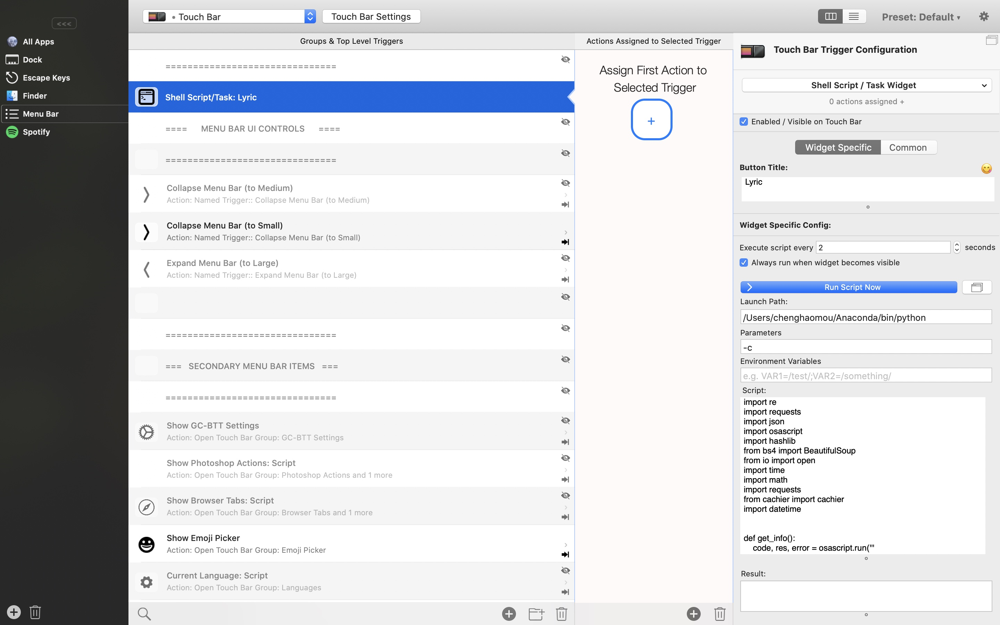
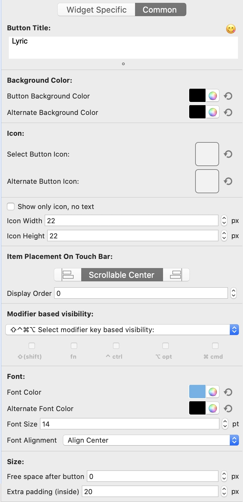
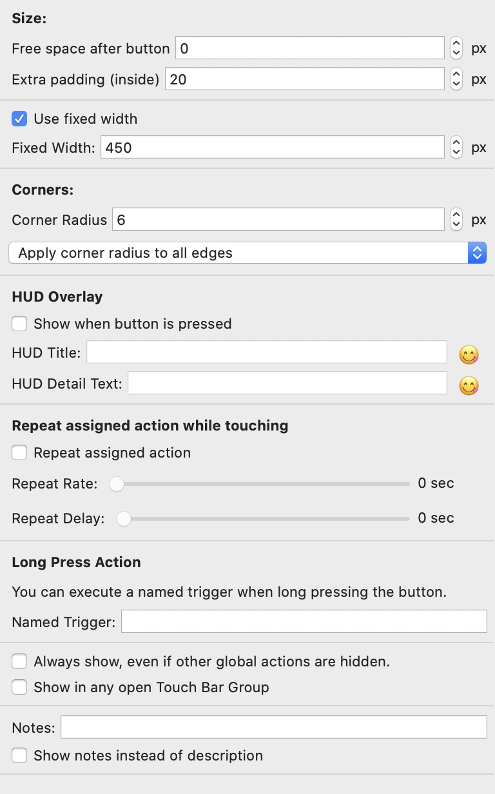

# touchbar-lyric

Show synced lyric in the touch-bar with BetterTouchTool and NetEase APIs. Based on the idea of [Kashi](https://community.folivora.ai/t/kashi-show-current-song-lyrics-on-touch-bar-spotify-itunes-youtube/6301)

## Implementation

I used netease music web apis for synced lyrics and cachier to reduce the need to crawl the webpage. Apple script for Spotify & **Music** information retrieval.

Note: I am using Catalina, so 'iTunes' in previous macOS is now 'Music'. You can change the 'Music' back to 'iTunes'.

## Instruction

### 1. Denpendencies

```shell
pip install requests osascript bs4 cachier hanziconv pinyin
```

### 2. Configuration in BetterTouchTool





## Preview


Note: In case there is no synced lyric, each sentence will be displayed at an evenly time interval.
